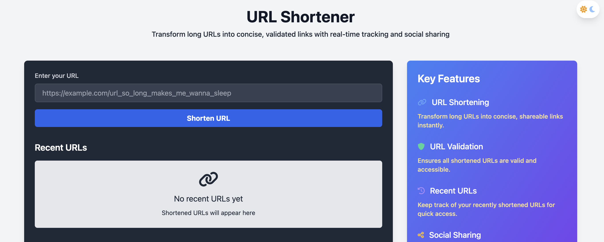

# URL Shortener



A simple and efficient URL shortener service built with Flask and Redis.

## Live Demo

Try it out: [https://tiny-h4p2.onrender.com/](https://tiny-h4p2.onrender.com/)

## Features

- Shorten long URLs to manageable links
- Modern, responsive UI with Tailwind CSS
- Redis for fast and efficient storage
- Copy-to-clipboard functionality
- Input validation and error handling
- Duplicate URL detection

## Tech Stack

- **Backend**: Flask (Python)
- **Database**: Redis
- **Frontend**: HTML, JavaScript, Tailwind CSS
- **Deployment**: Render.com

## Local Development

1. Create a virtual environment:
   ```bash
   python3 -m venv venv
   source venv/bin/activate  # On Windows: venv\Scripts\activate
   ```

2. Install dependencies:
   ```bash
   pip install -r requirements.txt
   ```

3. Set up environment variables:
   ```bash
   # Create .env file with:
   REDIS_HOST=your-redis-cloud-host
   REDIS_PORT=your-redis-port
   REDIS_PASSWORD=your-redis-password  # Required for Redis Cloud
   SECRET_KEY=your-secret-key
   ```

   For production, use Redis Cloud credentials from your dashboard.

4. Run Redis (make sure Redis is installed):
   ```bash
   redis-server
   ```

5. Run the application:
   ```bash
   python wsgi.py
   ```

## Deployment

This application is configured for deployment on Render.com. Required environment variables:

- `REDIS_HOST`
- `REDIS_PORT`
- `REDIS_PASSWORD`
- `SECRET_KEY`

## License

MIT License
